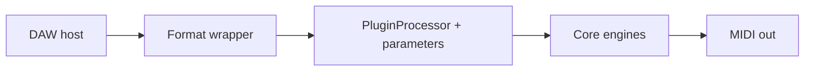

# Generative MIDI

**Pick a style → it writes the notes → send them to any instrument.**

An open-source generative MIDI effect for macOS, built end-to-end in C++/JUCE: ten note-generating engines, plugin wrappers, and the tests and records behind them.

**Live site (project showcase):** [Home](https://joshband.github.io/GenerativeMIDI/index.html) · [Engineering](https://joshband.github.io/GenerativeMIDI/engineering.html)
The site is served from the [`docs/`](docs/) folder (Settings → Pages → branch `master`, folder `/docs`).

[](https://github.com/joshband/GenerativeMIDI/actions/workflows/ci.yml)
[](LICENSE)
[](https://github.com/joshband/GenerativeMIDI/releases/latest)

---

## What it does

| Generators (10 in the editor) | Formats | Also included |
|-------------------------------|---------|---------------|
| Euclidean, Polyrhythm (experimental) | AU, VST3, Standalone (macOS, build-verified) | Scale quantization, swing, gate, ratchet |
| Markov, L-System, Cellular, Probabilistic | VST3 builds in CI on Windows and Linux | MIDI expression: note-on aftertouch / pitch bend / CC (not MPE) |
| Brownian, Perlin, Drunk Walk, Lorenz | AUv3 (iOS/iPadOS): configured build target, **not store-ready** | 11 factory presets; 38 registered parameters (37 automatable) |



---

## Quick start

Add it to your DAW as a **MIDI effect**, choose a generator, then route its MIDI output to an instrument.

Building from source is preferred; packaged releases may lag the current status in [STATUS.md](STATUS.md). Whatever appears on [Releases](https://github.com/joshband/GenerativeMIDI/releases) goes here:

- `Generative MIDI.component` → `~/Library/Audio/Plug-Ins/Components/`
- `Generative MIDI.vst3` → `~/Library/Audio/Plug-Ins/VST3/`

A first walkthrough is in [Getting Started](docs/user/GETTING_STARTED.md); every control is described in the [Features guide](docs/user/FEATURES.md).

---

## Build from source

Requires macOS, CMake 3.15+, JUCE (CI builds against 8.0.15), and Xcode Command Line Tools.

```bash
git clone --recurse-submodules https://github.com/joshband/GenerativeMIDI.git
cd GenerativeMIDI
# Already cloned without submodules?  git submodule update --init --recursive
ln -s ~/JUCE JUCE                      # point JUCE/ at your JUCE checkout

mkdir build && cd build
cmake .. -DCMAKE_BUILD_TYPE=Release
cmake --build . --config Release -j8
ctest --output-on-failure              # 29 Catch2 test cases
```

Artifacts land in `build/GenerativeMIDI_artefacts/Release/` (`AU/`, `VST3/`, `Standalone/`).
Troubleshooting, install paths, and AU validation: [docs/developer/BUILD.md](docs/developer/BUILD.md). iOS/iPadOS: [docs/developer/BUILDING-iOS.md](docs/developer/BUILDING-iOS.md) (`./build_ios.sh`).

---

## Status and boundary

Development status is **v0.8.0**, tracked in [STATUS.md](STATUS.md). CI ([`ci.yml`](.github/workflows/ci.yml)) builds on macOS, iOS, Windows, and Linux, runs `ctest`, and runs pluginval on the VST3 build. Not claimed: App Store readiness, MPE or continuous CC/pitch-bend modulation, a full modulation matrix, or test-coverage percentages. See the [roadmap](docs/developer/ENHANCEMENTS.md) for what is next.

---

## Documentation

| Audience | Start here |
|----------|------------|
| Users | [Getting Started](docs/user/GETTING_STARTED.md) · [Features](docs/user/FEATURES.md) · [Presets](docs/user/PRESET_GUIDE.md) · [REAPER quick start](docs/user/REAPER_QUICK_START.md) · [Smoke checklist](docs/user/SMOKE_CHECKLIST.md) |
| Developers | [Build](docs/developer/BUILD.md) · [CI](docs/developer/CI.md) · [Roadmap](docs/developer/ENHANCEMENTS.md) · [Changelog](CHANGELOG.md) |
| QA | [QA findings v0.8.0](docs/qa/QA_FINDINGS_v0.8.0.md) · [REAPER MCP setup](docs/qa/reaper/MCP_SETUP.md) |
| Design | [UI spec](docs/design/SYNAPTIK_UI_SPEC.md) · [Color palette](docs/design/COLOR_PALETTE.md) · [Component specs](docs/design/COMPONENT_SPECS.md) |

Architecture and design decisions: [Engineering case study](https://joshband.github.io/GenerativeMIDI/engineering.html).

---

## Contributing

Fork, branch, build, run `ctest --output-on-failure`, and open a pull request against `master`. Keep PRs focused and match the existing code style.
Bugs: [Issues](https://github.com/joshband/GenerativeMIDI/issues) · Ideas: [Discussions](https://github.com/joshband/GenerativeMIDI/discussions)

## License

[MIT](LICENSE). Algorithm references (Toussaint, Björklund, Lindenmayer, Wolfram) are credited in the [Features guide](docs/user/FEATURES.md).
