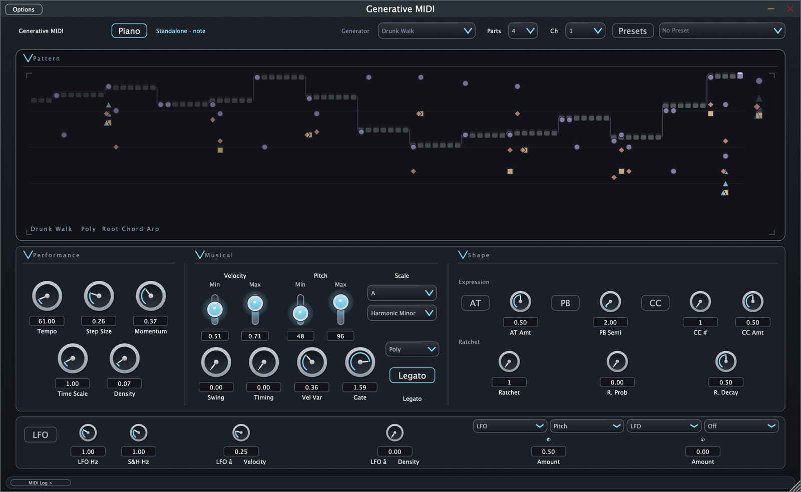
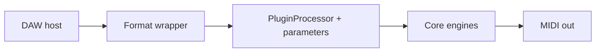

# Generative MIDI

**A plugin that invents melodies and rhythms for you. Pick a style, and it writes the notes and sends them to the instrument you choose.**

Music software talks to instruments using **MIDI**: messages that say which note to play, how hard, and for how long. Generative MIDI is a *MIDI effect*. It makes no sound itself. It creates the notes and passes them on, so any synthesizer or sampler in your music app can play them.

It is an open-source development project (**v1.0.0** per `CMakeLists.txt` and the GitHub release; [STATUS.md](STATUS.md) labels its feature snapshot v0.8.0), written in C++/[JUCE](https://juce.com). It is not a finished or store-ready product.

**Live site:** [Overview](https://joshband.github.io/GenerativeMIDI/index.html) · [Engineering case study](https://joshband.github.io/GenerativeMIDI/engineering.html)

[](https://github.com/joshband/GenerativeMIDI/actions/workflows/ci.yml)
[](LICENSE)



*Real screenshot of the Standalone app, cropped from the repo's QA captures (22 Sep 2026). Playback is stopped, so the pattern display is empty. The interface may have changed since.*

---

## What it does today

| Generators (10) | Formats | Also included |
|-----------------|---------|---------------|
| Euclidean, Polyrhythm (experimental) | AU, VST3, Standalone on macOS | Scale quantization, swing, gate, ratchet |
| Markov, L-System, Cellular, Probabilistic | VST3 + Standalone also build in CI on Windows and Linux | Note-on expression: aftertouch, pitch bend, CC (fixed amounts, not MPE) |
| Brownian, Perlin, Drunk Walk, Lorenz | AUv3 (iPhone/iPad): builds in CI, **not store-ready** | 11 factory presets; 57 registered parameters (56 automatable) |

Terms such as *Euclidean rhythm* or *ratchet* are explained in the site's [glossary](https://joshband.github.io/GenerativeMIDI/index.html#glossary).



The host loads the plugin through a format wrapper. The processor reads the parameters, one of the core engines generates notes, and the notes leave as MIDI.

## Try it

1. Build it (below) or take a package from [Releases](https://github.com/joshband/GenerativeMIDI/releases). Releases may lag [STATUS.md](STATUS.md).
2. Run the **Standalone** app to explore, or copy the plugin into your DAW:
   - `Generative MIDI.component` → `~/Library/Audio/Plug-Ins/Components/`
   - `Generative MIDI.vst3` → `~/Library/Audio/Plug-Ins/VST3/`
3. In your DAW, put it on a track as a **MIDI effect**, choose a generator, and route its output to an instrument.
4. Press play in the DAW: notes are generated while the host transport is playing (the host smoke test checks that a stopped transport emits none).

Walkthroughs: [Getting Started](docs/user/GETTING_STARTED.md) · [REAPER quick start](docs/user/REAPER_QUICK_START.md) · [all controls](docs/user/FEATURES.md).

## Build from source

Requires macOS, CMake 3.15+, Xcode Command Line Tools, and a JUCE checkout (CI uses 8.0.15).

```bash
git clone --recurse-submodules https://github.com/joshband/GenerativeMIDI.git
cd GenerativeMIDI
ln -s ~/JUCE JUCE                        # point JUCE/ at your JUCE checkout
cmake -S . -B build -DCMAKE_BUILD_TYPE=Release
cmake --build build --config Release -j8
(cd build && ctest --output-on-failure)
```

Artifacts appear in `build/GenerativeMIDI_artefacts/Release/` under `AU/`, `VST3/`, and `Standalone/`. Details and troubleshooting: [BUILD.md](docs/developer/BUILD.md). iOS/iPadOS: [BUILDING-iOS.md](docs/developer/BUILDING-iOS.md).

## What the checks prove

| Check | Proves | Does not prove |
|-------|--------|----------------|
| `ctest` (43 Catch2 cases: 35 in `Tests/EngineTests.cpp`, 8 in `Tests/HostSmokeTests.cpp`) | Engine logic, preset round-trips, and a headless host smoke test behave as written | Real-DAW behavior, UI behavior, audio quality |
| CI ([`ci.yml`](.github/workflows/ci.yml)): macOS, iOS, Windows, Linux builds; `ctest` on macOS, Windows, Linux; pluginval on the VST3 build | The code compiles on four platforms and the VST3 passes pluginval (strictness 5, GUI tests skipped) | AU validation (not run in CI), running on a real iOS device |
| Manual [smoke checklist](docs/user/SMOKE_CHECKLIST.md) and [QA findings](docs/qa/QA_FINDINGS_v0.8.0.md) | A person exercised the Standalone app and REAPER transport on recorded dates | Every DAW, every host version |

To validate the AU locally after installing it: `auval -v aumi Gmid Osrc`. The codes come from `CMakeLists.txt`, and a recorded run is in [`docs/qa/logs/auval.txt`](docs/qa/logs/auval.txt).

## Status and boundary

Not claimed: App Store readiness, MPE, continuous CC/pitch-bend modulation, a full modulation matrix, or test-coverage percentages. The Polyrhythm generator is experimental. Next steps are in the [roadmap](docs/developer/ENHANCEMENTS.md).

## For developers and AI agents

- Layers, from the host inward: format wrappers → `Source/PluginProcessor.*` (parameters via APVTS, generator dispatch) → `Source/Core/` (engines) → `Source/UI/` (editor).
- Generator choice is the `generatorType` parameter: index 0 Euclidean, 1 Polyrhythm, 2-5 algorithmic, 6-9 stochastic.
- Realtime rule: avoid allocation in the audio path. A known exception is the trained Markov lookup (see [STATUS.md](STATUS.md)).
- Start with [engineering case study](https://joshband.github.io/GenerativeMIDI/engineering.html), [CI](docs/developer/CI.md), and [CHANGELOG](CHANGELOG.md).

## Documentation

| Audience | Start here |
|----------|------------|
| Users | [Getting Started](docs/user/GETTING_STARTED.md) · [Features](docs/user/FEATURES.md) · [Presets](docs/user/PRESET_GUIDE.md) |
| Developers | [Build](docs/developer/BUILD.md) · [CI](docs/developer/CI.md) · [Roadmap](docs/developer/ENHANCEMENTS.md) |
| QA | [QA findings](docs/qa/QA_FINDINGS_v0.8.0.md) · [REAPER MCP setup](docs/qa/reaper/MCP_SETUP.md) |
| Design | [UI spec](docs/design/SYNAPTIK_UI_SPEC.md) · [Palette](docs/design/COLOR_PALETTE.md) · [Components](docs/design/COMPONENT_SPECS.md) |

## Contributing and license

Fork, branch, build, run `ctest`, and open a pull request against `master`. Keep changes focused and match the existing style. Report bugs in [Issues](https://github.com/joshband/GenerativeMIDI/issues).

[MIT](LICENSE). Algorithm references are credited in the [Features guide](docs/user/FEATURES.md).
