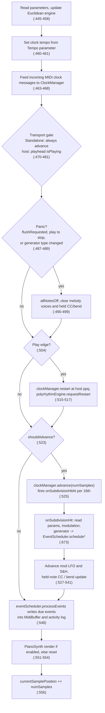

# Architecture

How the plugin is put together, how one audio block flows through it, and which thread touches what. Every non-obvious claim cites `path:line` at commit `bde6731`; line numbers drift, so re-check them when you edit the code.

## Module map

| Area | Files | Responsibility |
|------|-------|----------------|
| Processor | `Source/PluginProcessor.{h,cpp}` | The `GenerativeMIDIProcessor`: parameter layout (APVTS), `processBlock`, the per-step generator dispatch (`onSubdivisionHit`, `Source/PluginProcessor.cpp:673`), state save/load. |
| Editor | `Source/PluginEditor.{h,cpp}` | The plugin window. One 30 Hz `juce::Timer` (`Source/PluginEditor.cpp:677`) refreshes the visualisers and drains the MIDI activity log. |
| Core engines | `Source/Core/` | Pattern and note logic with no host dependency. |
| | `EuclideanEngine`, `PolyrhythmEngine`, `StochasticEngine`, `AlgorithmicEngine` | The generators (Euclidean; multi-layer polyrhythm; Brownian/Perlin/Drunk Walk/Lorenz; Markov/L-System/Cellular/Probabilistic). |
| | `SwingEngine`, `GateLengthController`, `RatchetEngine` | Per-note timing, length and repeat shaping. |
| | `HarmonyParts.h`, `ScaleQuantizer.h` | Scale triad / channel offsets for root, chord and arp parts; snapping pitches to a scale. |
| | `PresetManager` | Saving, loading and listing presets. |
| | `GeneratorTypeMapping.h` | Mapping between the `generatorType` parameter index and the engine enums, plus preset schema migration. |
| | `MIDIGenerator`, `TimeSignature.h` | Extended MIDI event helpers; time-signature sanitising. |
| DSP | `Source/DSP/` | Timing and event delivery. |
| | `ClockManager` | Sixteenth-note grid; calls `onSubdivisionHitAt(subdivision, sampleOffset)` for each hit inside a block (`Source/DSP/ClockManager.cpp:66`). |
| | `EventScheduler` | Sample-timed queue of note / CC / pitch-bend events; writes due events into the block's `MidiBuffer`, tracks sounding notes for `allNotesOff`. |
| | `NoteSchedulerHelpers.h` | Shared note scheduling with ratchets and gate length. |
| | `MidiActivityLog.h` | Lock-free FIFO of recent note events for the editor's activity pane. |
| | `PianoSynth.h` | Small fixed-voice tone generator rendered after MIDI is produced (`Source/PluginProcessor.cpp:551`). |
| Modulation | `Source/Modulation/` | `ModLfo.h` (sine LFO and sample-and-hold), `ModulationRouter.h` (turns slot settings and source values into a mix), `ModulationDestination.h` (destination enum). Design notes: [MODULATION_V2.md](MODULATION_V2.md). |
| UI | `Source/UI/` | `PatternVisualizer`, `MidiActivityPane`, `PolyrhythmLayerEditor`, `PresetBrowser`, `CustomLookAndFeel`, `AccessibleComboBox`. |

## Per-block data flow

`GenerativeMIDIProcessor::processBlock` (`Source/PluginProcessor.cpp:434`). There is no separate generation pass: `processGenerativeOutput` is an empty hook (`Source/PluginProcessor.cpp:559-563`); notes are produced inside `clockManager.advance` through the `onSubdivisionHitAt` callback.

Notes:

- Scheduled events carry absolute sample times (`stepSample = currentSamplePosition + sampleOffset`, `Source/PluginProcessor.cpp:678`), so a step late in a block lands at the right offset in `processEvents`.
- Parameters are read with `parameters.getRawParameterValue(...)->load()` both in `processBlock` and again inside every `onSubdivisionHit` (`Source/PluginProcessor.cpp:681-720` onwards). See "Realtime rules" for the cost.

## Threading model

### Who runs where

| Thread | Code |
|--------|------|
| Audio thread | `processBlock` and everything it calls: `ClockManager::advance`, `onSubdivisionHit`, the engines' generation methods, `PolyrhythmEngine::processTick`, `EventScheduler`, `PianoSynth`, `MidiActivityLog::tryPush*`, `AlgorithmicEngine`/`StochasticEngine` stepping. |
| Message / UI thread | The editor, including its 30 Hz `timerCallback` (`Source/PluginEditor.cpp:1691`); `PolyrhythmLayerEditor`'s own 30 Hz timer (`Source/UI/PolyrhythmLayerEditor.h:387`, callback at `:530`); `PresetBrowser`'s 2 s timer (`Source/UI/PresetBrowser.cpp:184`); layer edits from the UI. |
| Host-owned thread | `setStateInformation` / `getStateInformation` (`Source/PluginProcessor.cpp:1058`, `:1084`) and `prepareToPlay` / `releaseResources`. Which thread the host uses is host-specific; the code does not assume the message thread. |

`PatternVisualizer` and `MidiActivityPane` own no timers. `PatternVisualizer` states it is refreshed by the editor's 30 Hz timer (`Source/UI/PatternVisualizer.h:8`), and `MidiActivityPane` is fed by `midiActivityPane.ingest(...)` from that same timer callback (`Source/PluginEditor.cpp:1879`).

### `std::atomic` state (`grep std::atomic Source`)

| Atomic | Writer -> reader | Where |
|--------|------------------|-------|
| `noteActivityCounter` | audio increments (relaxed), editor timer polls for a change to pulse the activity indicator | `Source/PluginProcessor.h:210`, `Source/PluginEditor.cpp:1695` |
| `clockAdvancing` | audio stores each block, editor reads via `isClockAdvancing()` | `Source/PluginProcessor.h:211`, `Source/PluginProcessor.cpp:481`, `Source/PluginEditor.cpp:1722` |
| `flushRequested` | set by `releaseResources` (host thread), consumed with `exchange(false)` in `processBlock` as one of the panic triggers | `Source/PluginProcessor.h:239`, `Source/PluginProcessor.cpp:392`, `:487` |
| `PolyrhythmEngine::restartRequested` | `requestRestart()` (release store; called from the audio thread on the play edge), consumed in `applyPendingReset` | `Source/Core/PolyrhythmEngine.h:128`, `:174`, `Source/Core/PolyrhythmEngine.cpp:85` |
| `PolyrhythmEngine::current` / `hazard` | snapshot pointer swap (writers) / hazard pointer (audio) | `Source/Core/PolyrhythmEngine.h:168-169` |
| `PlayState::step` / `tick` | audio advances; UI reads `getCurrentStep` | `Source/Core/PolyrhythmEngine.h:152-153` |
| `EventScheduler::droppedEvents` / `droppedNoteOffs` | overflow counters | `Source/DSP/EventScheduler.h:112-113` |
| `ModLfo` / sample-and-hold `currentValue` | atomic float member in each | `Source/Modulation/ModLfo.h:80`, `Source/Modulation/ModulationRouter.h:93` |
| `AlgorithmicEngine::bits`, `sizeBits`, `generation`, `historySerial` | cellular / Markov state published for the pattern view | `Source/Core/AlgorithmicEngine.h:116-118`, `:234` |

I did not trace readers for the `ModLfo`/S&H `currentValue` members.

### MIDI activity log

`MidiActivityLog` is a single-producer / single-consumer ring built on `juce::AbstractFifo` over a fixed `std::array` (`Source/DSP/MidiActivityLog.h:113-114`). The audio thread calls `tryPush` / `tryPushFromMessage`: `prepareToWrite`, store, `finishedWrite`, no allocation; when full the newest event is dropped (`:42-51`). `EventScheduler` and the panic paths receive a pointer to the log and push into it (`Source/PluginProcessor.cpp:492`, `:548`). The editor timer calls `pop(drained, kMaxEvents)` and hands the result to the pane (`Source/PluginEditor.cpp:1876-1879`). Capacity is 63 usable events (`kMaxEvents`, `:36`), so a stalled UI loses events, never blocks audio.

### Polyrhythm layers

`PolyrhythmEngine` documents its own thread model in the header (`Source/Core/PolyrhythmEngine.h:45-56`):

- Layer configuration is an immutable `Snapshot`. Every mutator (`addLayer`, `setStep`, `loadFromValueTree`, ...) copies the current snapshot under `writeLock`, edits the copy and publishes it with an atomic pointer exchange (`Source/Core/PolyrhythmEngine.cpp:41-63`).
- The audio thread pins the current snapshot with a hazard pointer (`pin()`, `Source/Core/PolyrhythmEngine.cpp:26-39`), reads it in `processTick`, and unpins. Writers free retired snapshots only when they are not the pinned one (`:47-51`). The audio path takes no lock and does not allocate or free.
- Live counters (`step`, `tick`) are atomics outside the snapshot, so editing a layer does not reset playback unless `loadId` changes (load / remove, `applyPendingReset`, `:83-91`).
- Restart on the play edge is a flag (`restartRequested`), not a call into the writer lock.
- The host test `Polyrhythm layers can be edited while processBlock runs` (`Tests/HostSmokeTests.cpp:1354`) exercises edits concurrent with `processBlock`. It is most informative under the TSan/ASan builds (see [CI.md](CI.md)).

### Locks

`grep CriticalSection|SpinLock|std::mutex|ScopedLock|ScopedTryLock Source` finds exactly one lock: `PolyrhythmEngine::writeLock` (`Source/Core/PolyrhythmEngine.h:171`, taken at `Source/Core/PolyrhythmEngine.cpp:57`, `:307`, `:315`, `:431`). It is taken by `mutate` (all editing calls), `reset`, `resetLayer` and `toValueTree`. None of the audio-thread entry points (`processTick`, `shouldEmitOnThisTick`, `advanceStep`, `requestRestart`) take it. `getStateInformation` calls `toValueTree`, so a host that saves state while a UI edit holds the lock simply waits on that thread; this does not involve the audio thread.

### Realtime rules

For code on the audio thread (everything reachable from `processBlock`):

1. No heap allocation or free: use fixed arrays and preallocated storage (see `EventScheduler::prepare`, `Source/PluginProcessor.cpp:375`, and the fixed `melodyVoices[16]`, `Source/PluginProcessor.h:248`).
2. No locks, no waiting, no I/O, no logging.
3. No `juce::String` construction or parameter lookup by string where it can be avoided.
4. Share state with other threads only through `std::atomic`, the `MidiActivityLog` FIFO, or the `PolyrhythmEngine` snapshot scheme above.
5. Any new cross-thread state needs a host test, and should be run under the TSan job (`GENMIDI_SANITIZE=thread`, [CI.md](CI.md)).

Known debt: the audio thread still resolves parameters by string, via `parameters.getRawParameterValue(PARAM_*)` once per block and again per generated step (79 lines mentioning `getRawParameterValue` in `Source/PluginProcessor.cpp`, e.g. `:446`, `:681`, `:698`). `getRawParameterValue` walks a map keyed by the parameter ID; caching the returned `std::atomic<float>*` pointers after construction would remove the lookups. README also lists a known exception for the trained Markov lookup ([README.md](../../README.md), "For developers and AI agents"); I did not audit that path for this document.

## Transport

Current behaviour (`Source/PluginProcessor.cpp:470-519`):

- **Standalone free-runs.** `shouldAdvance` is `true` unless the wrapper is not Standalone and the host playhead reports "not playing" (`:472-480`).
- **Hosts gate on `isPlaying`.** If `getPlayHead()->getPosition()` exists, `shouldAdvance = position->getIsPlaying()`. If the host provides no position, the processor keeps advancing.
- **Stopping releases notes.** A `wasAdvancing && !shouldAdvance` transition triggers the panic path: `allNotesOff` plus clearing melody voices and held CC / pitch-bend state (`:487-499`).
- **Play edge restarts the grid.** On `shouldAdvance && !wasAdvancing` the grid starts at the host ppq (converted to sixteenths, `ppq * 4`) when the host provides one, otherwise at 0. `ClockManager::restart` sets the sample position and the offset to the next sixteenth (`Source/DSP/ClockManager.cpp:54-64`), the polyrhythm layers are told to restart, and `lastSubdivisionStep` is set to match (`:504-518`).
- Tempo is always the `Tempo` parameter today (`:460-461`); the host BPM is not read.

### Host tempo and position jumps

- **Sync to Host** (`syncToHost`, bool, default on, the last parameter in `createParameterLayout`). When it is on and the host reports a BPM, that BPM drives the clock, clamped to the Tempo parameter's range. When the host reports none, or Sync is off, the Tempo parameter is used. Standalone never reads the host playhead, so it keeps the internal tempo and free-runs.
- The host position is read once per block (`hostPosition` in `processBlock`) and reused for the transport gate, the tempo and the jump check.
- **Loop wraps and jumps.** While playing, each block predicts the host ppq from the previous block: `lastHostPpq + (lastBlockSamples / sampleRate) * (lastBlockTempo / 60)`. `lastBlockTempo` is the host's reported BPM when there is one, because the host's ppq advances at the host tempo even when Sync is off. If the reported ppq differs from the prediction by more than a quarter of a sixteenth (`1.0 / 16.0` quarter notes), the block is treated as a loop wrap or position jump: `releaseAllVoices` sends all-notes-off, and `realignToHost` restarts the grid at the new position (the same path as the play edge). A tempo change with a continuous ppq is not a jump. A block that is already a play edge or a panic skips the check.

## Testing

Both executables are defined in `CMakeLists.txt` and registered with CTest through `catch_discover_tests` (`CMakeLists.txt:217-218`).

- **`GenerativeMIDITests`** (`CMakeLists.txt:150`): engine-only. `Tests/EngineTests.cpp` plus a fixed source list: `EuclideanEngine`, `PolyrhythmEngine`, `StochasticEngine`, `AlgorithmicEngine`, `PresetManager`, `ClockManager`. It does not link the plugin, so code added elsewhere is not compiled into it unless you add the `.cpp` to that list (header-only code reached through those files' includes is compiled too).
- **`GenerativeMIDIHostSmokeTests`** (`CMakeLists.txt:180`): `Tests/HostSmokeTests.cpp`, linked against the full `GenerativeMIDI` target. It drives `GenerativeMIDIProcessor::processBlock` directly with a `FakePlayHead` (`Tests/HostSmokeTests.cpp:30`) standing in for a host. Because the processor is not a Standalone wrapper there, the transport gate applies.

Counts are intentionally not stated here; recount from the test files when a number is needed. CI runs both under ASan+UBSan on every non-draft PR, and under TSan on the full matrix ([CI.md](CI.md)).
