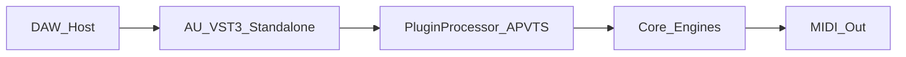

# GitHub Pages Showcase Implementation Plan

> **For agentic workers:** REQUIRED SUB-SKILL: Use superpowers:subagent-driven-development (recommended) or superpowers:executing-plans to implement this plan task-by-task. Steps use checkbox (`- [ ]`) syntax for tracking.

**Goal:** Ship a hiring-facing two-page GitHub Pages site from `/docs` that sells Josh Band + Generative MIDI with claims grounded in current repo evidence.

**Architecture:** Static overlay at docs root — `index.html` (Home skim) and `engineering.html` (case study) share `docs/assets/` (CSS, JS, one illustrative signal-path SVG). Existing markdown under `docs/` stays as evidence; proof links use GitHub blob URLs on `master`. No frameworks, no Listen/audio in v1.

**Tech Stack:** Hand-authored HTML5, CSS3 (custom properties, no preprocessor), vanilla JS, inline SVG, Google Fonts (Fraunces + Karla).

**Spec:** [docs/superpowers/specs/2026-09-21-github-pages-showcase-design.md](docs/superpowers/specs/2026-09-21-github-pages-showcase-design.md)

**Public URL:** `https://joshband.github.io/GenerativeMIDI/` (project Pages — all asset/href paths must be **relative**, never root-absolute `/…`).

---

## File map

| Path | Role |
|------|------|
| Create `docs/assets/site.css` | Forge tokens, layout, hero atmosphere, motion, proof table, responsive |
| Create `docs/assets/site.js` | Section reveal observer; reduced-motion respect |
| Create `docs/assets/signal-path.svg` | Illustrative Host → Wrapper → Processor → Engines → MIDI out |
| Create `docs/index.html` | Home sections 1–6 per spec |
| Create `docs/engineering.html` | Engineering sections 1–6 per spec |
| Modify [docs/README.md](docs/README.md) | Public face = Pages; markdown = internal evidence |
| Modify [README.md](README.md) | Showcase link + Pages setup; soften misleading lead claims |
| Modify [.gitignore](.gitignore) | Ignore `.superpowers/` |

Also save this plan to `docs/superpowers/plans/2026-09-21-github-pages-showcase.md` when implementing (mirror of approved plan).

---

## Claim lock (verify in Task 0; copy into HTML verbatim)

- Status version: **v0.8.0** ([STATUS.md](STATUS.md))
- Build-verified: macOS **AU / VST3 / Standalone** ([BUILD_VERIFICATION.md](BUILD_VERIFICATION.md))
- **AUv3**: listed in [CMakeLists.txt](CMakeLists.txt) `FORMATS` + iOS docs — “configured target,” not store-ready
- Generators: **9 in current UI**; Polyrhythm retained in core/params, not in editor dropdown ([Source/PluginEditor.cpp](Source/PluginEditor.cpp) vs [Source/PluginProcessor.cpp](Source/PluginProcessor.cpp))
- Parameters: **31** (STATUS)
- Tests: **manual testing** + build verification — no coverage %
- No screenshots, no audio, no App Store readiness language

**Blob base:** `https://github.com/joshband/GenerativeMIDI/blob/master/`

---

## Visual tokens (lock in CSS)

```css
:root {
  --bg-deep: #0c1014;
  --bg-panel: #141a1f;
  --brass: #c9954a;
  --brass-soft: #e8d5b0;
  --steel: #4a8ca8;
  --steel-bright: #7a9eae;
  --text: #d8dde2;
  --text-muted: #8a939c;
  --rule: rgba(201, 149, 74, 0.28);
  --font-display: "Fraunces", Georgia, serif;
  --font-body: "Karla", "Segoe UI", sans-serif;
}
```

Motion: (1) hero radial drift keyframes, (2) `[data-reveal]` fade/slide via IntersectionObserver, (3) CTA/proof link hover/focus steel underline. Honor `prefers-reduced-motion: reduce`.

---

## Signal path (illustrative)



SVG caption on both pages: “Illustrative signal path — not a measured trace.”

---

### Task 0: Re-verify claims + ignore brainstorm junk

**Files:** Modify `.gitignore`; read-only check STATUS / BUILD_VERIFICATION / CMake / Editor combo

- [ ] **Step 1:** Confirm claim lock against disk (generator UI list still 9; STATUS still v0.8.0; BUILD_VERIFICATION still AU/VST3/Standalone). If anything drifted, update claim lock before HTML.

- [ ] **Step 2:** Append to `.gitignore`:

```
# Local brainstorm / agent session artifacts
.superpowers/
```

- [ ] **Step 3:** Commit

```bash
git add .gitignore
git commit -m "chore: ignore local .superpowers brainstorm artifacts"
```

---

### Task 1: Shared CSS + JS + diagram

**Files:** Create `docs/assets/site.css`, `docs/assets/site.js`, `docs/assets/signal-path.svg`

- [ ] **Step 1:** Create `docs/assets/site.css` with tokens above; base reset; skip-link; sticky minimal nav; full-bleed `.hero` with layered radial gradients + CSS grain (`::before` noise or SVG filter); dual-brand stack (`.brand-builder` / `.brand-product` equal weight); section spacing; `.claim-grid` (3 columns → 1 on small); `.method-steps` ordered list; `.boundary` two columns; proof table styles; footer; `@media (max-width: 720px)` stacks; reduced-motion block.

- [ ] **Step 2:** Create `docs/assets/site.js`:

```js
(function () {
  if (window.matchMedia("(prefers-reduced-motion: reduce)").matches) return;
  const nodes = document.querySelectorAll("[data-reveal]");
  if (!nodes.length || !("IntersectionObserver" in window)) {
    nodes.forEach((n) => n.classList.add("is-visible"));
    return;
  }
  const io = new IntersectionObserver(
    (entries) => {
      entries.forEach((e) => {
        if (e.isIntersecting) {
          e.target.classList.add("is-visible");
          io.unobserve(e.target);
        }
      });
    },
    { rootMargin: "0px 0px -8% 0px", threshold: 0.12 }
  );
  nodes.forEach((n) => io.observe(n));
})();
```

- [ ] **Step 3:** Create `docs/assets/signal-path.svg` — horizontal (stack vertically under ~600 viewBox width) labeled boxes: Host → Format wrapper → Processor / params → Engines → MIDI out. Stroke/fill using brass/steel-friendly colors (`#c9954a`, `#4a8ca8`, `#d8dde2` on dark `#0c1014`). No fake metrics.

- [ ] **Step 4:** Commit

```bash
git add docs/assets/
git commit -m "feat(pages): add forge assets, motion helper, and signal-path diagram"
```

---

### Task 2: Home page

**Files:** Create `docs/index.html`

- [ ] **Step 1:** Write full `docs/index.html`:
  - `<head>`: charset, viewport, title `Josh Band · Generative MIDI`, meta description (hiring thesis, not App Store), Google Fonts preconnect + Fraunces/Karla, `assets/site.css`
  - Nav: Home (current) · Engineering · GitHub (`https://github.com/joshband/GenerativeMIDI`)
  - Hero: equal brands; thesis ≈ “Full-stack ownership of a generative MIDI plugin system — engines, host formats, and verification.”; one support sentence; CTAs Engineering + GitHub only
  - Sections in order: What this proves (3 claims) → Agentic practice (4-step method, human gate) → System at a glance (`` + illustrative caption) → Boundary (shipped vs deferred using claim lock) → About (Josh Band + GitHub only)
  - `data-reveal` on non-hero sections; `assets/site.js` before `</body>`
  - No cards in hero; no Listen; no screenshots

- [ ] **Step 2:** Local smoke: `python3 -m http.server 8765 --directory docs` → open `http://127.0.0.1:8765/` — check nav, fonts, hero, relative CSS/JS/SVG load.

- [ ] **Step 3:** Commit

```bash
git add docs/index.html
git commit -m "feat(pages): add hiring Home page for Generative MIDI showcase"
```

---

### Task 3: Engineering page

**Files:** Create `docs/engineering.html`

- [ ] **Step 1:** Write full `docs/engineering.html` with same head/nav/footer pattern; sections:
  1. Problem/thesis
  2. Architecture + same SVG + illustrative caption
  3. Hard parts (realtime/scheduling; parameter bridging incl. Polyrhythm UI/param mismatch; bypass/lifecycle; measurement = manual + build verify)
  4. Proof table — columns Evidence / What it shows / Link — rows for STATUS, BUILD_VERIFICATION, CHANGELOG, CMakeLists.txt, docs/developer/BUILD.md, docs/design/SYNAPTIK_UI_SPEC.md, docs/sessions/ (index), REPOSITORY_AUDIT — blob URLs
  5. Design-decision highlights (LookAndFeel vs bitmap; SynaptikUIToolkit submodule; modulation archived; Polyrhythm deferred from UI)
  6. What’s next (MIDI expression UI; polyrhythm layer controls — STATUS, no oversell)

- [ ] **Step 2:** Smoke both pages + cross-links at `http://127.0.0.1:8765/engineering.html`.

- [ ] **Step 3:** Commit

```bash
git add docs/engineering.html
git commit -m "feat(pages): add Engineering case study page with proof table"
```

---

### Task 4: README + docs index

**Files:** Modify `README.md`, `docs/README.md`

- [ ] **Step 1:** At top of root `README.md` (after title / before or replacing hype lead), add:

```markdown
## Showcase

Hiring-facing project site (architecture, ownership, and on-disk evidence):
**https://joshband.github.io/GenerativeMIDI/**

### GitHub Pages setup

Repository → **Settings** → **Pages** → Build and deployment → Source: **Deploy from a branch** → Branch: `master` → Folder: `/docs` → Save.
```

- Soften the opening paragraph: do not claim “10 engines” without the UI/param nuance; prefer “generative MIDI processor (macOS AU / VST3 / Standalone; see STATUS for current scope)” and point employers to the showcase for honest status.
- If `docs/design/screenshots/main-interface.png` is still missing, remove or comment out the broken image embed (do not invent a screenshot).

- [ ] **Step 2:** Rewrite lead of `docs/README.md` to state HTML Pages (`index.html` / `engineering.html`) are the public face; remaining markdown is internal/developer evidence. Keep the existing doc index links.

- [ ] **Step 3:** Commit

```bash
git add README.md docs/README.md
git commit -m "docs: point README at Pages showcase and document /docs deploy"
```

---

### Task 5: Honesty + responsive verification

**Files:** none (checklist); fix HTML/CSS if failures found

- [ ] **Step 1:** Serve `docs/` and check desktop (~1280) and narrow (~390): hero readable, no horizontal overflow, CTAs tappable, table scrolls or stacks.
- [ ] **Step 2:** Honesty pass — every number on both pages matches claim lock; diagram caption present; no Listen/App Store/finished-UI implications; proof links return 200 on github.com (or correct blob paths).
- [ ] **Step 3:** Commit any fixes

```bash
git add docs/
git commit -m "fix(pages): tighten honesty labels and mobile layout"
```

---

### Task 6: Persist plan file

**Files:** Create `docs/superpowers/plans/2026-09-21-github-pages-showcase.md`

- [ ] **Step 1:** Copy the approved implementation plan into that path (this document).
- [ ] **Step 2:** Commit

```bash
git add docs/superpowers/plans/2026-09-21-github-pages-showcase.md
git commit -m "docs: add GitHub Pages showcase implementation plan"
```

---

## Spec coverage check

| Spec requirement | Task |
|------------------|------|
| Dual-brand hero, no Listen | Task 2 |
| What this proves / agentic / diagram / boundary / about | Task 2 |
| Engineering case study + proof table | Task 3 |
| Forge visual + 2–3 motions | Task 1 |
| Relative assets for project Pages | Tasks 1–3 |
| README Pages URL + setup | Task 4 |
| Claim honesty / no fake media | Tasks 0, 5 |
| `.superpowers/` gitignore | Task 0 |

## Out of scope (do not implement)

Listen/audio, nested `/docs/site`, markdown absorb/archive moves, frameworks, non-GitHub contact, enabling Pages in GitHub Settings (document only; user clicks Save).
